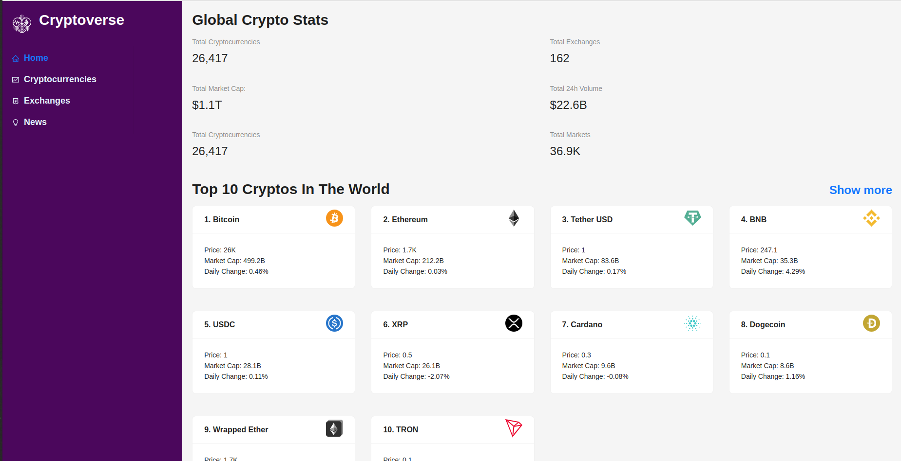
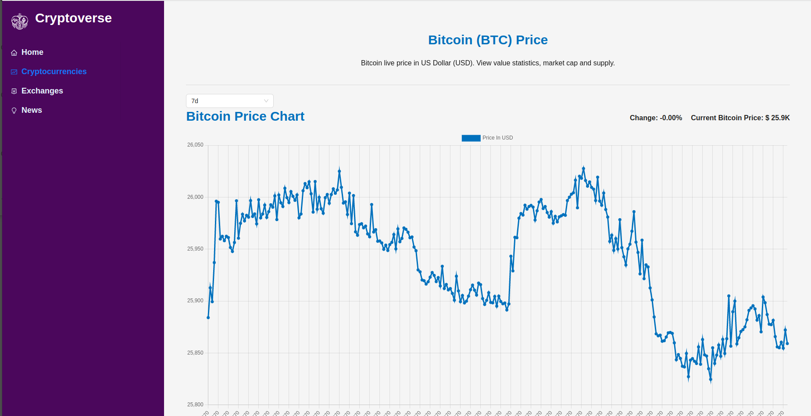
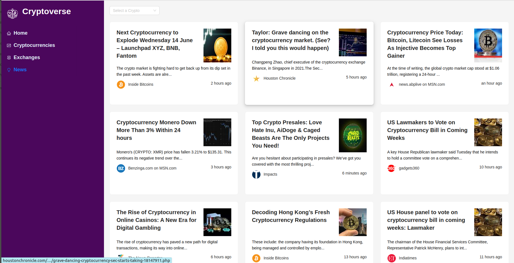

# Cryptoverse - Explore the World of Cryptocurrency

## Introduction

In this repository i create a cryptocurrency app. I used React,Redux/toolkit, Ant Design  and multiple APIs powered by https://rapidapi.com.

Tis Project is Developed to 
## Available Scripts
### Crypto Home

## Crypto Detail

 ## News 

In the project directory, you can run:
### `git clone https://github.com/samisams1/cryptocurrency-.git`
### `cd client`
#### `npm install`
### `npm start`

